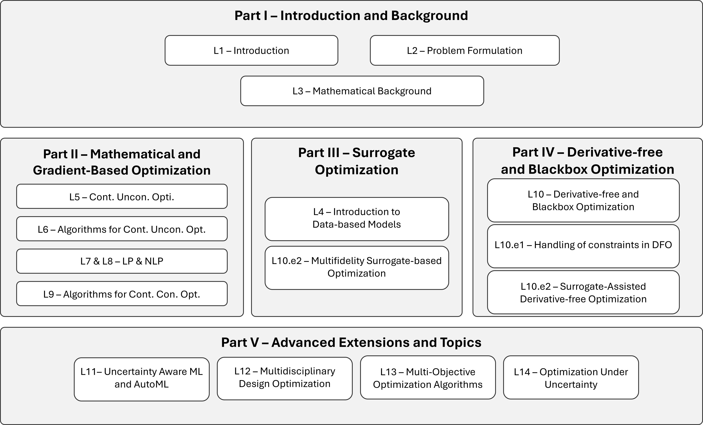

# MECH 559 — Engineering Systems Optimization

**McGill University, Department of Mechanical Engineering**

**Instructor:** Dr. Ahmed Bayoumy (`ahmed.bayoumy@mcgill.ca` - `ahmed.bayoumy@mail.mcgill.ca`)
**Notebooks author:** Dr. Ahmed Bayoumy

This repository hosts the Python/Jupyter notebooks used throughout MECH 559. Every notebook can be
launched directly in Google Colab with no local setup — just click a badge below.

## Course description

This course introduces the theory and application of *systems-oriented* engineering design
optimization. The course emphasizes: i) understanding and representing complex engineering systems
and their structure; ii) obtaining, developing, and managing appropriate computational models for
engineering analysis, including both physics-based and data-driven approaches; iii) constructing
suitable design models and formulating well-posed optimization problems for engineering synthesis;
iv) applying numerical optimization algorithms while accounting for issues related to numerical
analysis, multidisciplinary interactions, and systems integration; v) formulating and solving
multidisciplinary design optimization (MDO) problems involving multiple interacting disciplines;
vi) multiobjective optimization and Pareto optimality; and vii) employing artificial intelligence
(AI) and machine learning (ML) techniques to accelerate the MDO process through data-driven
decision making. The course concludes with an introduction to advanced topics including
coordination strategies for distributed MDO, AI-driven MDO, multi-fidelity optimization, and
optimization under uncertainty.

### Course breakdown

The course is organized into five parts: **(I)** introduction and mathematical background,
**(II)** mathematical and gradient-based optimization (unconstrained and constrained, LP/NLP),
**(III)** surrogate/data-based optimization, **(IV)** derivative-free and blackbox optimization,
and **(V)** advanced extensions — uncertainty-aware ML/AutoML, multidisciplinary design
optimization, multi-objective algorithms, and optimization under uncertainty.

## Notebooks

Each notebook opens in Colab already runnable — all of them rely only on `numpy`, `scipy`,
`matplotlib`, `sympy`, and `pandas`, which are preinstalled on Colab (the one exception,
`L01_MDO_wing.ipynb`, installs the extra `pyxdsm` package itself on first run).

### L01 — Introduction: analytical design optimization examples

| | Notebook | Description |
|---|---|---|
|  | [L01_airfoil_optimization](L01/L01_airfoil_optimization.ipynb) | Analytical 2D airfoil section design optimization using NACA four-digit parameters, where lift, drag, and structural weight are computed—not chosen—quantities. |
|  | [L01_beam_optimization](L01/L01_beam_optimization.ipynb) | Analytical cantilever beam design optimization in 1D and 2D, including a parametric study and an ε-constraint Pareto front. |
|  | [L01_MDO_wing](L01/L01_MDO_wing.ipynb) | A two-discipline (aerodynamics + structures) wing MDO problem solved via an MDF coupling loop, an XDSM diagram, and a drag-vs-weight Pareto front. |

### L02 — First hands-on optimization example

| | Notebook | Description |
|---|---|---|
|  | [L02_rosenbrock_optimization](L02/L02_rosenbrock_optimization.ipynb) | Solves the classic unconstrained and inequality-constrained Rosenbrock problems with SciPy's optimizer. |

### L03 — Mathematical background and monotonicity analysis

| | Notebook | Description |
|---|---|---|
|  | [L03_extreme_value_theorem](L03/L03_extreme_value_theorem.ipynb) | Builds the norm → distance → continuity → compact-set chain of reasoning behind the Extreme Value Theorem and the existence of optimizers. |
|  | [L03_monotonicity_analysis](L03/L03_monotonicity_analysis.ipynb) | Uses monotonicity analysis on the 2D cantilever beam problem to predict which constraints bound variables and become active before solving the optimization. |
|  | [L03_monotonicity_MP1_MP2_concepts](L03/L03_monotonicity_MP1_MP2_concepts.ipynb) | Illustrates the First and Second Monotonicity Principles (activity, criticality, dominance, consistency, relaxation) on toy problems and a hydraulic cylinder actuator design. |
|  | [L03_blackbox_monotonicity_LHS (advanced-optional)](<L03/L03_blackbox_monotonicity_LHS (advanced-optional).ipynb>) | *(Advanced/optional)* Applies monotonicity-style reasoning to a black-box model (no visible equations or gradients) sampled via Latin Hypercube Sampling. |

### L04 — Data-based models and surrogate optimization

| | Notebook | Description |
|---|---|---|
|  | [L04_design_of_experiments](L04/L04_design_of_experiments.ipynb) | Compares full-factorial, random, and Latin hypercube sampling plans, then fits and validates a first polynomial surrogate model. |
|  | [L04_polynomial_regression](L04/L04_polynomial_regression.ipynb) | Fits polynomial surrogates via the normal equations, then demonstrates and fixes ill-conditioning with ridge regularization and variable scaling. |
|  | [L04_radial_basis_functions](L04/L04_radial_basis_functions.ipynb) | Builds a radial basis function interpolant from scratch and explores how the kernel spread parameter trades off smoothness against accuracy. |
|  | [L04_kriging_gaussian_process](L04/L04_kriging_gaussian_process.ipynb) | Implements ordinary Kriging (Gaussian process regression) from scratch, including maximum-likelihood hyperparameter selection and predictive variance. |
|  | [L04_neural_networks](L04/L04_neural_networks.ipynb) | Builds a feedforward neural network from scratch — forward pass, backpropagation verified against finite differences, and gradient-descent training. |
|  | [L04_neural_network_ensembles](L04/L04_neural_network_ensembles.ipynb) | Trains an ensemble of neural networks and uses their prediction spread as a model-free uncertainty estimate, the neural-network analogue of Kriging's variance. |
|  | [L04_surrogate_model_comparison](L04/L04_surrogate_model_comparison.ipynb) | Fairly compares polynomial+ridge, RBF, and Kriging surrogates on the same data using k-fold cross-validation and a held-out reference set. |

### L05 — Continuous unconstrained optimization theory

| | Notebook | Description |
|---|---|---|
|  | [L05_taylor_series_and_foncs](L05/L05_taylor_series_and_foncs.ipynb) | Rebuilds Taylor-series approximations and the first-order necessary condition (FONC) computationally, including finding and classifying stationary points. |
|  | [L05_FONC_demonstration](L05/L05_FONC_demonstration.ipynb) | Applies a general stationary-point finder to a multimodal function and a least-squares fit to show exactly what the FONC does and does not guarantee. |
|  | [L05_hessians_soscs_and_definiteness](L05/L05_hessians_soscs_and_definiteness.ipynb) | Builds the gradient/Hessian machinery and three practical positive-definiteness tests behind the second-order sufficient condition (SOSC). |
|  | [L05_SOSC_demonstration](L05/L05_SOSC_demonstration.ipynb) | Uses a Hessian-based classifier to sort Himmelblau's nine stationary points into minima, a maximum, and saddles, showing where the SOSC stops being informative. |
|  | [L05_convexity](L05/L05_convexity.ipynb) | Tests sets and functions for convexity directly from their definitions and shows why a stationary point of a convex function is automatically a global minimizer. |
|  | [L05_constrained_to_unconstrained](L05/L05_constrained_to_unconstrained.ipynb) | Works a constrained cylinder design problem end to end by eliminating the active constraint via substitution and verifying the resulting unconstrained minimizer. |

### L06 — Algorithms for continuous unconstrained optimization

| | Notebook | Description |
|---|---|---|
|  | [L06_gradient_descent_and_line_search](L06/L06_gradient_descent_and_line_search.ipynb) | Shows what makes a direction a descent direction, why fixed-step steepest descent can fail, and how exact/Armijo line search fixes it. |
|  | [L06_newton_and_quasi_newton](L06/L06_newton_and_quasi_newton.ipynb) | Builds Newton's method and the BFGS quasi-Newton update from scratch and compares their convergence speed against gradient descent. |
|  | [L06_conjugate_gradients](L06/L06_conjugate_gradients.ipynb) | Builds the conjugate-gradient method from Q-orthogonal directions through the exact quadratic algorithm to Hessian-free nonlinear variants (Fletcher-Reeves, Polak-Ribière). |
|  | [L06_stabilization_and_scaling](L06/L06_stabilization_and_scaling.ipynb) | Demonstrates what goes wrong when Newton's Hessian isn't positive definite and how Hessian modification and variable scaling fix convergence. |
|  | [L06_trust_region](L06/L06_trust_region.ipynb) | Builds a trust-region subproblem solver and adaptive-radius algorithm from scratch, showing where it succeeds when plain Newton's method fails. |

## License

See [LICENSE](LICENSE).
